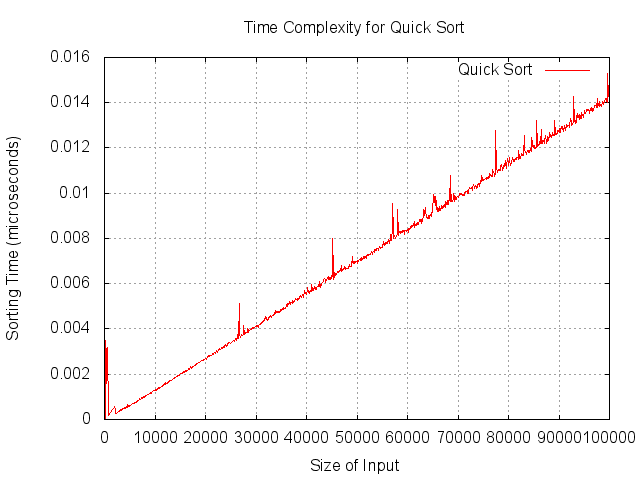

## Aim:
To Sort a given set of elements using the Quicksort method and determine the time required to sort the elements. Repeat the experiment for different values of n, the number of elements in the list to be sorted and plot a graph of the time taken versus n. The elements can be read from a file or can be generated using the random number generator.
## Description:
>The program is based on the Quicksort algorithm which is an instatiation of divide and conquer method of solving the problem. Here the given array is partitioned every time and the sub-array is sorted.Dividing is based on an element called pivot. A divide and conquer algorithm works by recursively breaking down a problem into two or more sub-problems of the same (or related) type, until these become simple enough to be solved directly. The solutions to the sub-problems are then combined to give a solution to the original problem.

## Algorithm:

1. Pick an element, called a pivot, from the list.
2. Reorder the list so that all elements with values less than the pivot come before the pivot, while all elements with values greater than the pivot come after it (equal values can go either way). After this partitioning, the pivot is in its final position. This is called the partition operation.
3. Recursively apply the above steps to the sub-list of elements with smaller values and separately the sub-list of elements with greater values.

## Code:

	#include <stdio.h>
	#include <stdlib.h>
	#include <sys/time.h>
	#include <time.h>

	void fnGenRandInput(int [], int);
	void fnDispArray( int [], int);
	int fnPartition(int [], int , int );
	void fnQuickSort(int [], int , int );
	inline void fnSwap(int*, int*);

	inline void fnSwap(int *a, int *b)
	{
		int t = *a; *a = *b; *b = t;
	}

	/******************************************************************************
	*Function	: main
	*Input parameters:
	*	int argc - no of commamd line arguments
	*	char **argv - vector to store command line argumennts
	*RETURNS	:	0 on success
	******************************************************************************/

	int main( int argc, char **argv)
	{

		FILE *fp;
		struct timeval tv;
		double dStart,dEnd;
		int iaArr[500000],iNum,iPos,iKey,i,iChoice;

	    for(;;)
	    {
		printf("\n1.Plot the Graph\n2.QuickSort\n3.Exit");
		printf("\nEnter your choice\n");
		scanf("%d",&iChoice);

		switch(iChoice)
		{
		    case 1:
		        fp = fopen("QuickPlot.dat","w");

		        for(i=100;i<100000;i+=100)
		        {
		            fnGenRandInput(iaArr,i);

		            gettimeofday(&tv,NULL);
		            dStart = tv.tv_sec + (tv.tv_usec/1000000.0);

		            fnQuickSort(iaArr,0,i-1);

		            gettimeofday(&tv,NULL);
		            dEnd = tv.tv_sec + (tv.tv_usec/1000000.0);

		            fprintf(fp,"%d\t%lf\n",i,dEnd-dStart);

		        }
		        fclose(fp);

		        printf("\nData File generated and stored in file < QuickPlot.dat >.\n Use a plotting utility\n");
		    break;

		    case 2:
		        printf("\nEnter the number of elements to sort\n");
		        scanf("%d",&iNum);
		        printf("\nUnsorted Array\n");
		        fnGenRandInput(iaArr,iNum);
		        fnDispArray(iaArr,iNum);
		        fnQuickSort(iaArr,0,iNum-1);
		        printf("\nSorted Array\n");
		        fnDispArray(iaArr,iNum);
		    break;

		    case 3:
		        exit(0);
		}
	    }

		return 0;
	}

	/******************************************************************************
	*Function	: fnPartition
	*Description	: Function to partition an iaArray using First element as Pivot
	*Input parameters:
	*	int a[] - iaArray to hold integers
	*	int l	- start index of the subiaArray to be sorted
	*	int r	- end index of the subiaArray to be sorted
	*RETURNS	: integer value specifying the location of partition
	******************************************************************************/

	int fnPartition(int a[], int l, int r)
	{
		int i,j,temp;
		int p;

		p = a[l];
		i = l;
		j = r+1;

		do
		{
			do { i++; } while (a[i] < p);
			do { j--; } while (a[j] > p);

			fnSwap(&a[i], &a[j]);
		}
		while (i<j);

		fnSwap(&a[i], &a[j]);
		fnSwap(&a[l], &a[j]);

		return j;
	}

	/******************************************************************************
	*Function	: fnQuickSort
	*Description	: Function to sort elements in an iaArray using Quick Sort
	*Input parameters:
	*	int a[] - iaArray to hold integers
	*	int l	- start index of the subiaArray to be sorted
	*	int r	- end index of the subiaArray to be sorted
	*RETURNS	: no value
	******************************************************************************/

	void fnQuickSort(int a[], int l, int r)
	{
		int s;

		if (l < r)
		{
			s = fnPartition(a, l, r);
			fnQuickSort(a, l, s-1);
			fnQuickSort(a, s+1, r);
		}
	}

	/******************************************************************************
	*Function	: GenRandInput
	*Description	: Function to generate a fixed number of random elements
	*Input parameters:
	*	int X[] - array to hold integers
	*	int n	- no of elements in the array
	*RETURNS	:no return value
	******************************************************************************/

	void fnGenRandInput(int X[], int n)
	{
		int i;

		srand(time(NULL));
		for(i=0;i<n;i++)
		{
			X[i] = rand()%10000;
		}

	}

	/******************************************************************************
	*Function	: DispArray
	*Description	: Function to display elements of an array
	*Input parameters:
	*	int X[] - array to hold integers
	*	int n	- no of elements in the array
	*RETURNS	: no return value
	******************************************************************************/

	void fnDispArray( int X[], int n)
	{
		int i;

		for(i=0;i<n;i++)
			printf(" %5d \n",X[i]);

	}

## OUTPUT:

