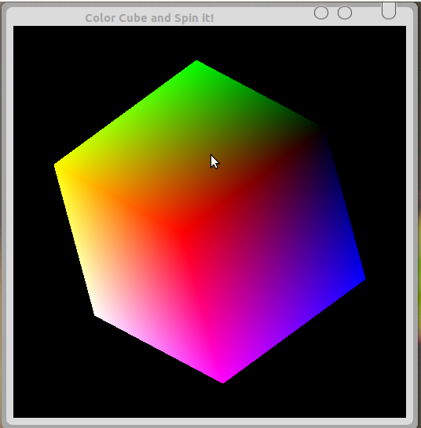

## Aim: 
### Program to draw a color cube and spin it using OpenGL transformation matrices.

## Algorithm
1. Choose eight 3 dimensional coordinate points such that will make a cube
2. Group the vertices together such that they make 6 faces.
3. Identify the button that was last pressed.
4. Rotate the cube by a small angle, along a particular axis;
   by associating one mouse button to one axis.

The following values assume vertices as show below:

```
   5-------6
  /|      /|
 / |     / |
1-------2  |
|  4----|--7
| /     | /
|/      |/
0-------3
```

## Code: spinCube.c
    #include<GL/glut.h>

    GLfloat vertices[]={-0.5f,-0.5f,-0.5f,    -0.5f,0.5f,-0.5f,    0.5f,0.5f,-0.5f,   0.5f,-0.5f,-0.5f,
                        -0.5f,-0.5f,0.5f,     -0.5f,0.5f,0.5f,     0.5f,0.5f,0.5f,    0.5f,-0.5f,0.5f};
    
    GLfloat colors[] = {0,0,0,   0,0,1,    0,1,0,    0,1,1,
                        1,0,0,   1,0,1,    1,1,0,    1,1,1};
    
    GLbyte faces[] = {0,1,2,3,   2,3,7,6,   4,5,6,7,  4,5,1,0,   5,6,2,1,   0,3,7,4};
    
    GLint currentBtn = GLUT_MIDDLE_BUTTON;
    
    void mouse(int btn, int state, int x, int y) {
      currentBtn = btn;
    }
    
    void display() {
      glClear(GL_COLOR_BUFFER_BIT | GL_DEPTH_BUFFER_BIT);
      glRotated(0.06,
                currentBtn == GLUT_LEFT_BUTTON,
                currentBtn == GLUT_MIDDLE_BUTTON,
                currentBtn == GLUT_RIGHT_BUTTON);
      glDrawElements(GL_QUADS, 24, GL_UNSIGNED_BYTE, faces);
      glFlush();
    }
    
    void glInit(int w, int h) {
      glClear(GL_COLOR_BUFFER_BIT | GL_DEPTH_BUFFER_BIT);
      glMatrixMode(GL_PROJECTION);
      glLoadIdentity();
      
      glEnableClientState(GL_COLOR_ARRAY);
      glEnableClientState(GL_VERTEX_ARRAY);
      glVertexPointer(3, GL_FLOAT, 0, vertices);
      glColorPointer(3, GL_FLOAT, 0, colors);
      glEnable(GL_DEPTH_TEST);

      glViewport(0, 0, w, h); // Resize viewport to width and height.
      if (h > w) //Maintain proper aspect ratio; otherwise the image would appear stretched
        glOrtho(-1.0, 1.0, (GLfloat) -h / w, (GLfloat) h / w, -1.0, 1.0);
      else
        glOrtho((GLfloat) -w / h, (GLfloat) w / h, -1.0, 1.0, -1.0, 1.0);
    }
    
    int main(int argc, char *argv[]) {
      glutInit(&argc, argv);
      glutInitWindowSize(720, 720);
      glutCreateWindow("Spin a cube");
      glutDisplayFunc(display);
      glutIdleFunc(display);
      glutReshapeFunc(glInit);
      glutMouseFunc(mouse);
      glutMainLoop();
    }

## Output:
*Commands for execution:-*

* Open a terminal and Change directory to the file location in both the terminals.
* compile as gcc -lGLU -lGL -lglut spinCube.c -o spincube
* If no errors, run as ./spincube

*Screenshots:-*

 	
