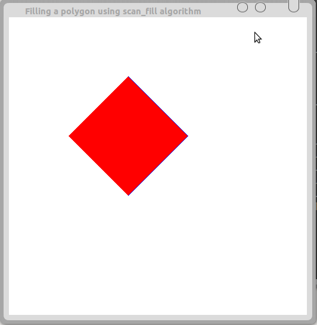

## Aim:
### Program to fill any given polygon using scan-line area filling algorithm.

## Algorithm:

For each scan line:
1. Find the intersections of the scan line with all edges of the polygon.
2. Sort the intersections by increasing x-coordinate.
3. Fill in all pixels between pairs of intersections.

## Code : 
    //scanFill.c
	#define BLACK 0
	#include<stdlib.h>
	#include<stdio.h>
	#include<GL/glut.h>
	float x1,x2,x3,x4,y1,y2,y3,y4;
	int k=0;
	void edgedetect(float x1,float y1,float x2,float y2,int *le,int *re)
	{
		float mx,x,temp;
		int i;
		if((y2-y1)<0)
		{
			temp=y1;y1=y2;y2=temp;
			temp=x1;x1=x2;x2=temp;
		}
		if((y2-y1)!=0)
			mx=(x2-x1)/(y2-y1);
		else
			mx=x2-x1;
		x=x1;
		for(i=y1;i<=y2;i++)
		{
			if(x<(float)le[i])
				le[i]=(int)x;
			if(x>(float)re[i])
				re[i]=(int)x;
			x+=mx;
		}
	}

	void draw_pixel(int x,int y,int value)
	{
		glColor3f(1.0,0.0,0.0);
		glBegin(GL_POINTS);
		glVertex2i(x,y);
		glEnd();
	}

	void scanfill(float x1,float y1,float x2,float y2,float x3,float y3,float x4,float y4)
	{
		int le[500],re[500];
		int i,j;
		for(i=0;i<500;i++)
		{
			le[i]=500;
			//le[i]=20;
			re[i]=0;
		}
		edgedetect(x1,y1,x2,y2,le,re);
		edgedetect(x2,y2,x3,y3,le,re);
		edgedetect(x3,y3,x4,y4,le,re);
		edgedetect(x4,y4,x1,y1,le,re);

		for(j=0;j<500;j=j+1)
		{
			if(le[j]<=re[j])
				for(i=(int)le[j];i<(int)re[j];i=i+1)
					draw_pixel(i,j,BLACK);
		}
	}

	void display()
	{
		x1=200.0;y1=200.0;x2=100.0;y2=300.0;x3=200.0;y3=400.0;x4=300.0;y4=300.0;
		glClear(GL_COLOR_BUFFER_BIT);
		glColor3f(0.0,0.0,1.0);
		glBegin(GL_LINE_LOOP);
			glVertex2f(x1,y1);
			glVertex2f(x2,y2);
			glVertex2f(x3,y3);
			glVertex2f(x4,y4);
		glEnd();
		scanfill(x1,y1,x2,y2,x3,y3,x4,y4);
		glFlush();
	}

	void myinit()
	{
		glClearColor(1.0,1.0,1.0,1.0);
		glColor3f(1.0,0.0,0.0);
		glPointSize(1.0);
		glMatrixMode(GL_PROJECTION);
		glLoadIdentity();
		gluOrtho2D(0.0,499.0,0.0,499.0);
	}

	void mykey(unsigned char key, int x, int y)
	{
		if(key=='k')
			k++;
	}

	int main(int argc,char **argv)
	{
		glutInit(&argc,argv);
		glutInitDisplayMode(GLUT_SINGLE|GLUT_RGB);
		glutInitWindowSize(500,500);
		glutInitWindowPosition(0,0);
		glutCreateWindow("Filling a polygon using scan_fill algorithm");
		glutDisplayFunc(display);
		glutKeyboardFunc(mykey);
		myinit();
		glutMainLoop();
	}

##Output:

*Commands for execution:-*

* Open a terminal and Change directory to the file location in both the terminals.
* compile as gcc -lGLU -lGL -lglut scanfill.c -o scanfill
* If no errors, run as ./scanfill.

*Screenshots:-*

