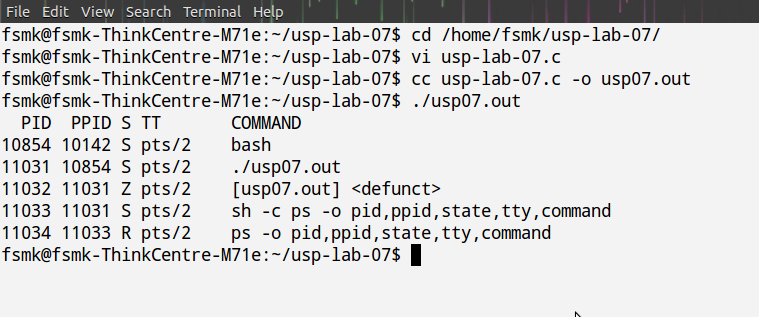

## Aim:

### Write a C/C++ program that creates a zombie and then calls system to execute the ps command to verify that the process is zombie.

## Theory:

In unix terminology, a process that has terminated, but whose parent has not yet waited for it, is called a zombie.  
*fork()*

Syntax:
<code><pre>
 \#include&lt;unistd.h&gt;
 pid_t fork(void);
</pre></code>

fork()  creates  a new process by duplicating the calling process.  The
new process, referred to as the child, is an  exact  duplicate of the calling  process,  referred  to as the parent.  
<em>Sleep()</em> : Delay for a specified amount of time.  
<em>System()</em>

Syntax:
<code><pre>
 \#include &lt;stdlib.h&gt;
 int system(const char *command);
</code></pre>

 system()  executes a command specified in command by calling /bin/sh -c command, and returns after the command has been completed.

## Code:
	#include&lt;stdio.h&gt; 
	#include<unistd.h>
	#include<stdlib.h>
	int main()
	{
		int pid;
		if((pid=fork())<0)
			printf("fork error\n");
		else if(pid==0)
			_exit(0);
		sleep(2);
		system( "ps -o pid,ppid,state,tty,command");
		_exit(0);
	}

## Output:
<ul>
 <li>Open a terminal</li>
 <li>Change directory to the file location in the terminal</li>
 <li>Complile the program by using the command 
     <code><pre> cc usp-lab-07.c -o usp07.out</pre></code></li>
 <li>Run 
     <code><pre> usp07.out</pre></code></li></ul>

## Screenshots:

