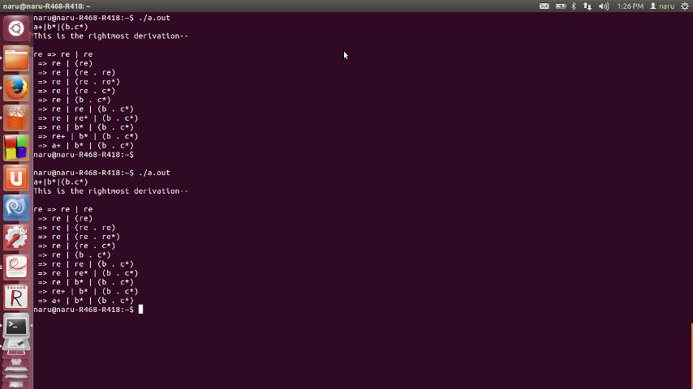

## Aim:
### Write a yacc program that accepts a regular expression as input and produce its parse tree as output.

### Description:

> Yacc- Yet another C Compiler defines what it is all by itself.  Computer program input generally has some structure; in fact, every computer program that does input can be thought of as defining an ``input language'' which it accepts. An input language may be as complex as a programming language, or as simple as a sequence of numbers. Unfortunately, usual input facilities are limited, difficult to use, and often are lax about checking their inputs for validity.

> Yacc provides a general tool for describing the input to a computer program. The Yacc user specifies the structures of his input, together with code to be invoked as each such structure is recognized. Yacc turns such a specification into a subroutine that han- dles the input process; frequently, it is convenient and appropriate to have most of the flow of control in the user's application handled by this subroutine. 

> Every Yacc specification file consists of three sections: the declarations, (grammar) rules, and programs. The sections are separated by double percent ``%%'' marks. (The percent % is generally used in Yacc specifications as an escape character.)
In other words, a full specification file looks like

        declarations
        %%
        rules
        %%
        programs

> The declaration section may be empty. Moreover, if the programs section is omitted, the second %% mark may be omitted also;thus,the smallest legal Yacc specification is

        %%
        rules
> The following command:

			yacc grammar.y

> draws yacc rules from the grammar.y file, and places the output in 	  y.tab.c.

> The following command:
	yacc  -d grammar.y
  functions the same as example 1, but it also produces the y.tab.h file            which would contain C-style #define statements for each of the tokens 
  defined in the grammar.y file.

### Algorithm:
1. Start
2. Accept an expression from the user.
3. Check for the structure that satisfies the conditions of a regular expression.
4. Print the parsed tree as output as when the conditions are satisfied.
5. End

### Code:
	%{/*declaration part*/
 	#include<stdio.h>
	#include<ctype.h>
	#include<stdlib.h>
	#include<string.h>
	#define MAX 100 /*to store productions*/
	int getREindex ( const char* );
	signed char productions[MAX][MAX];
	int count = 0 , i , j;
	char temp[200] , temp2[200];
	%}
	%token ALPHABET
	%left '|'
	%left '.'
	%nonassoc '*' '+'
	%%/*rules section*/
	S : re '\n' { 
	printf ( "This is the rightmost derivation--\n" );
	for ( i = count - 1 ; i >= 0 ; --i ) {
		if ( i == count - 1 ) {
			printf ( "\nre => " );
			strcpy ( temp , productions[i] );
			printf ( "%s" , productions[i] );
		}
		else {
			printf ( "\n => " );
			j = getREindex ( temp );	
			temp[j] = '\0';
			sprintf ( temp2 , "%s%s%s" , temp , productions[i] , (temp + j + 2) );
			printf ( "%s" , temp2 );
			strcpy ( temp , temp2 );
		}
	}
	printf ( "\n" );
	exit ( 0 ); 
	}
	re : ALPHABET { 
	temp[0] = yylval; temp[1] = '\0';
	strcpy ( productions[count++] , temp );/*copy the input to the prodcution array*/
	}/*only conditions defined here will be valid, this is the structure*/
	| '(' re ')' /*adds the (expression) to the production array*/
	{ strcpy ( productions[count++] , "(re)" ); }
	| re '*'     
	{ strcpy ( productions[count++] , "re*" ); }
	| re '+' /*adds expression+ type to the production array*/
	{ strcpy ( productions[count++] , "re+" ); }
	| re '|' re /*adds the expression|expression to the production array*/
	{strcpy ( productions[count++] , "re | re" );}
	| re '.' re/*adds the expression.expression to the production array*/ 
	{strcpy ( productions[count++] , "re . re" );}
	;
	%%
	int main ( int argc , char **argv ) 
	{
	/* 
	Parse and output the rightmost derivation,
	from which we can get the parse tree 
	*/
		yyparse();/*calls the parser*/
		return 0;
	}

	yylex() /*calls lex and takes each character as input and feeds ALPHABET to check for the structure*/
	{
		signed char ch = getchar();	
		yylval = ch;
		if ( isalpha ( ch ) )
			return ALPHABET;
		return ch;
	}

	yyerror() /*Function to alert user of invalid regular expressions*/
	{
		fprintf(stderr , "Invalid Regular Expression!!\n");
		exit ( 1 );
	}

	int getREindex ( const char *str ) 
	{ 
		int i = strlen ( str ) - 1;
		for ( ; i >= 0 ; --i ) {
			if ( str[i] == 'e' && str[i-1] == 'r' )
			return i-1;
		}
	}

### Output:-
*Commands for execution*

* Open a terminal
* Change your directory to the location of the file
* Run, yacc -d *filename.y* 
* Run, cc y.tab.c y.tab.h
* An output file a.out is created. 
* Run, ./a.out to execute the program.

### Screenshot:

